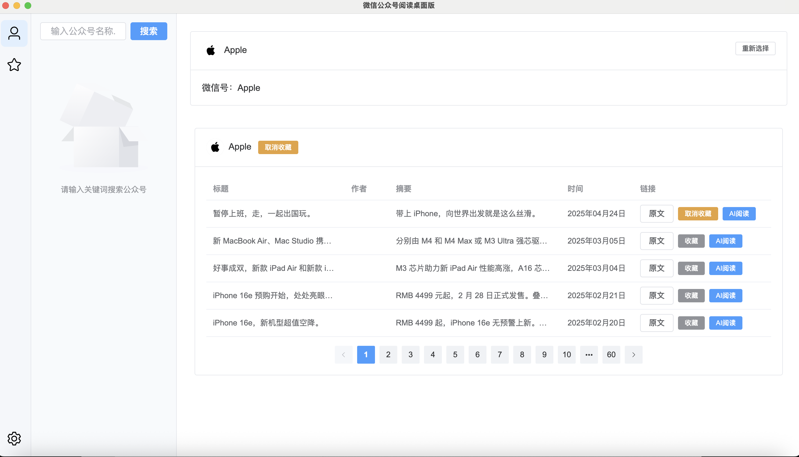
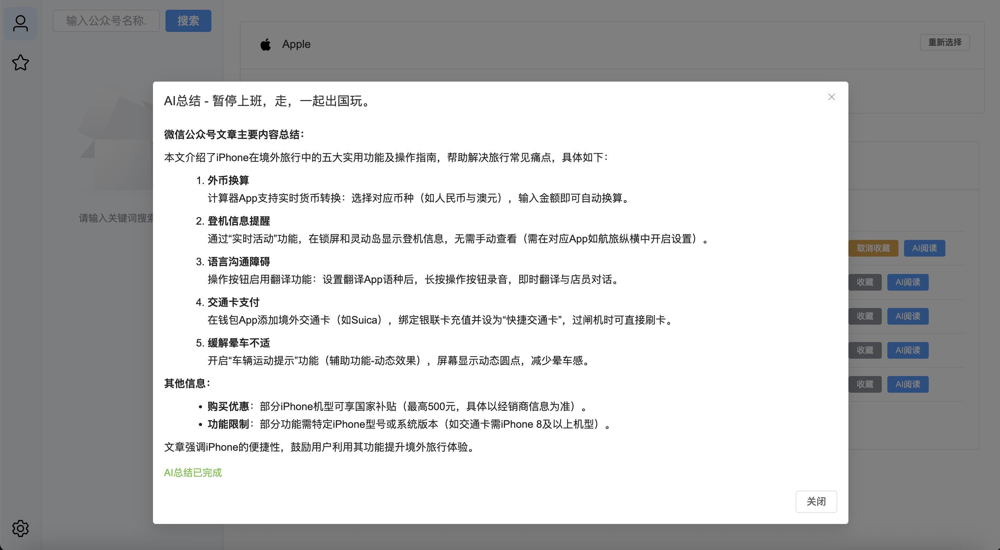
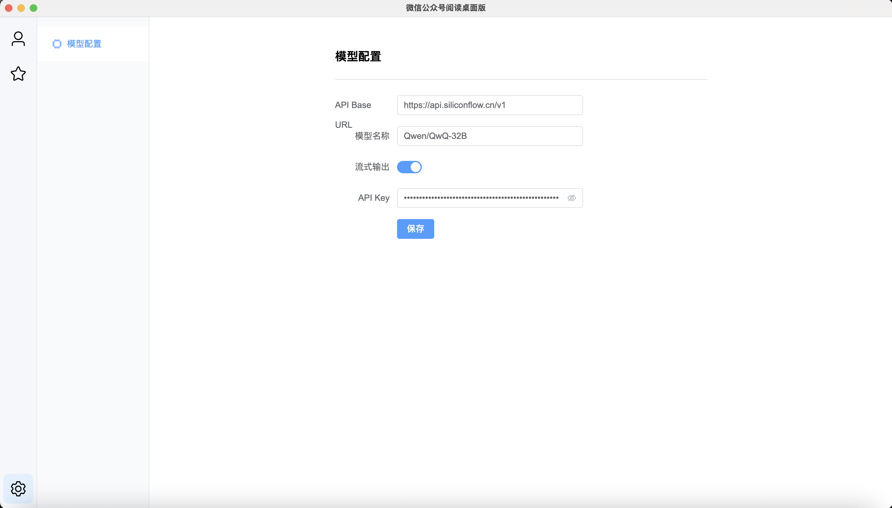

[English](README.en.md) | [中文说明](README.md)

# 恐龙公众号阅读器（Konglong WeChat Official Account Reader）

一个跨平台的 Electron 应用，用于微信公众账号的登录、文章搜索、收藏与 AI 总结，支持多种高级配置。

## 功能特性

- **微信扫码登录**：通过扫码安全登录公众号后台。
- **公众号搜索与管理**：支持搜索、收藏公众号。
- **文章列表与收藏**：浏览、搜索、收藏公众号文章。
- **AI 阅读与总结**：集成 OpenAI 模型对文章进行智能总结，支持自定义模型、接口和流式输出。
- **PDF 导出**：一键导出文章为 PDF 文件。
- **图片代理**：内置图片代理服务，解决微信图片防盗链问题。
- **持久化设置**：所有配置（包括 OpenAI API 设置）均本地 SQLite 存储。
- **现代化界面**：基于 Vue 3 + Element Plus，界面简洁美观。
- **跨平台支持**：兼容 Windows、macOS、Linux。

## 截图

登录:


文章列表 & AI阅读:



模型设置:


## 快速开始

### 环境要求
- [Node.js](https://nodejs.org/)（建议 v16 及以上）
- [Git](https://git-scm.com/)
- [pnpm](https://pnpm.io/) 或 [npm](https://www.npmjs.com/)

### 安装

```bash
git clone https://github.com/yourusername/konglong-reader.git
cd konglong-reader
npm install
```

### 开发调试

```bash
npm run start
```

### 打包发布

```bash
npm run dist
```

如需 Windows/macOS 指定平台打包：

```bash
npm run dist:win
# 或
npm run dist:win:x64
# 或
npm run dist:win:ia32
```

## 使用说明

1. **扫码登录**：打开应用后用微信扫码登录。
2. **搜索公众号**：通过搜索栏查找目标公众号。
3. **浏览文章**：点击公众号查看其历史文章。
4. **AI 阅读**：点击文章的"AI 阅读"按钮，获取 OpenAI 智能总结。
5. **收藏管理**：可收藏公众号和文章，便于快速访问。
6. **设置面板**：在"设置→模型配置"中自定义 OpenAI API 地址、模型、流式输出和 API Key。

## 配置说明
- 所有用户设置和收藏均保存在本地 SQLite 数据库（`fav.db`）。
- OpenAI API 配置可在应用内"设置→模型配置"页面修改。

## 目录结构

```
.
├── electron/                # Electron 主进程及后端逻辑
│   ├── main.js              # 应用入口，IPC、数据库、代理等
│   ├── renderer/            # 前端（Vue 3 + Element Plus）
│   │   ├── src/
│   │   │   ├── components/  # Vue 组件（ArticleList, GzhSearch, ModelConfigPanel 等）
│   │   │   └── App.vue      # 应用主壳
│   │   └── index.html
│   └── static/              # 静态资源（图标等）
├── wechat_spider_allpages.js # 微信爬虫与 AI 总结逻辑
├── login.js                 # 微信登录逻辑
├── package.json
└── README.md
```

## 依赖说明
- [Electron](https://www.electronjs.org/)
- [Vue 3](https://vuejs.org/)
- [Element Plus](https://element-plus.org/)
- [Puppeteer](https://pptr.dev/)
- [OpenAI Node.js SDK](https://github.com/openai/openai-node)
- [better-sqlite3](https://github.com/WiseLibs/better-sqlite3)
- [Axios](https://axios-http.com/)

## 许可证

MIT License  
Copyright (c) 2025 qopo

## 贡献方式

欢迎 PR！如有重大更改建议先提 Issue 讨论。

## 鸣谢
- 感谢所有贡献者和开源社区。

## 免责声明

此项目只供学习研究Electron技术，严谨用于非法行为，因使用该项目而产生的法律责任由用户自行承担，开发者不承担任何责任‌，发生的一切后果与本项目无关
---

如需补充徽章、FAQ、常见问题等内容，欢迎提出！ 